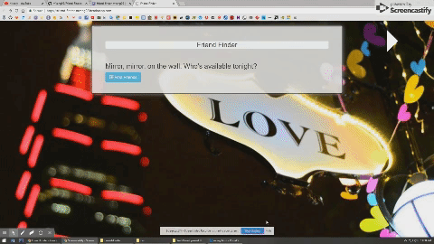

# Friend-Finder
Assignment 11 Friend Finder app featuring Node and Express Servers

## Program Description
This full-stack site will take in results from different surveys, then compare answers with those from other users. The app will then display the name and picture of the user with the best overall match.

## Prerequisites
1. To run the application on your local machine, you will need node.js, which can be downloaded via this link (https://nodejs.org/en/download/).
2. If you are on Windows, please also download Git Bash (https://git-scm.com/downloads). Mac users can use the built-in Terminal.
3. In Git Bash/Terminal, clone the repository for this app using this command line: git clone https://github.com/mVang92/Friend-Finder.git
4. After the cloning is complete, run this command: npm install
5. Finally, run this command to start the server: node server.js
6. Git Bash/Terminal will then display "Server listening on: http://localhost:3000".
7. Go to your internet browser. In the address bar, type this: localhost:3000
8. Press enter and you should be directed to the local host server to view the aplication.
9. Terminate the application through Git Bash/Terminal by pressing CTRL + C (Windows) or Command + C (Mac) at the same time.

## Demonstration

Check out the app here: https://friend-finder-mvang92.herokuapp.com/

## Technologies Used

* Javascript
* Node.js
* Express.js
* Postman
* Heroku