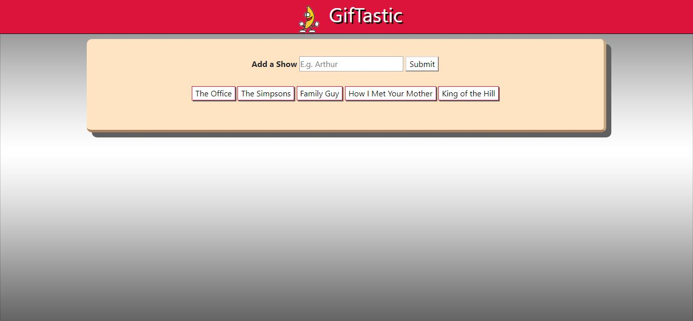
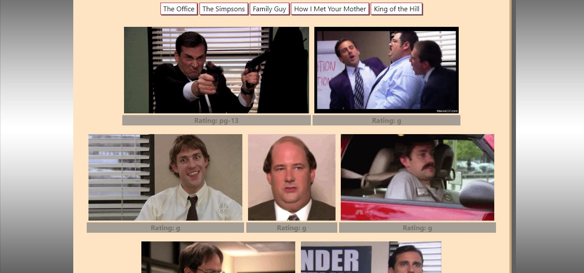

# GifTastic

### [View the app here](https://mvang92.github.io/GifTastic/)

## Program Description
This application uses the GIPHY API make a dynamic web page that populates with gifs of your choice. The API was called using JavaScript and jQuery to change the HTML of the site. To add more buttons, type something into the input box at the top and hit the submit button. Click on any of the buttons, and the still images related to the topic will populate the page along with their ratings. Click on any of the images to animate them. Clicking on a different button will erase the screen and repopulate it with new images.

## Screenshots

In the home page, the app already has a few topics to choose from by default. You can type in a new topic into the search box, and a new button will appear next to the defaut buttons.

Clicking on any of the buttons will populate the page with 10 images and their ratings. Clicking on a different button will erase the page and append new images and ratings.

## Technologies Used
* JavaScript
* jQuery
* Bootstrap
* API