# Bamazon
Assignment 10 Node.js &amp; MySQL

## Program Description
This program uses a MySQL database for customers and managers to interact with. This is a very basic program where customers can purchase items just like purchase something from an online website. In this program, customers may view the products and choose the products they want to purchase. Managers have a few more options, where they can view the products for sale, update inventory, and more. Let's take a look at how a customer interacts with the program.

## Prerequisites
1. To run the application on your local machine, you will need node.js, which can be downloaded via this link (https://nodejs.org/en/download/).
2. If you are on Windows, please also download Git Bash (https://git-scm.com/downloads). Mac users can use the built-in Terminal.
3. In Git Bash/Terminal, clone the repository for this app using this command line: git clone https://github.com/mVang92/Bamazon.git
4. After the cloning is complete, run this command: npm install inquirer mysql
5. To run the customer view, type this command: node bamazonCustomer.js
6. To run the manager view, type this command: node bamazonManager.js

#### Customer User Interface
Upon running the program, the customer is greeted with three options. They can view the products for sale, make a purchase, or simply exit the program.

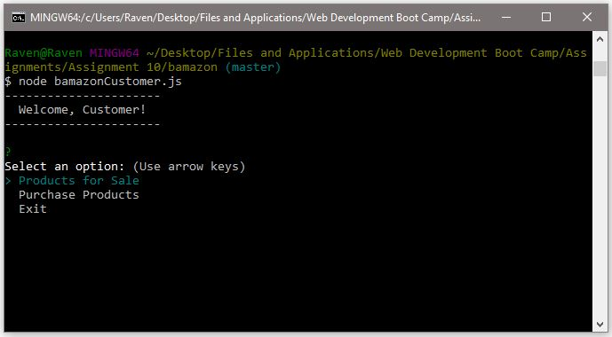

When the customer selects "Products for Sale", the program displays all of the items from the database to the user. This data includes the products item ID, product name, and price.

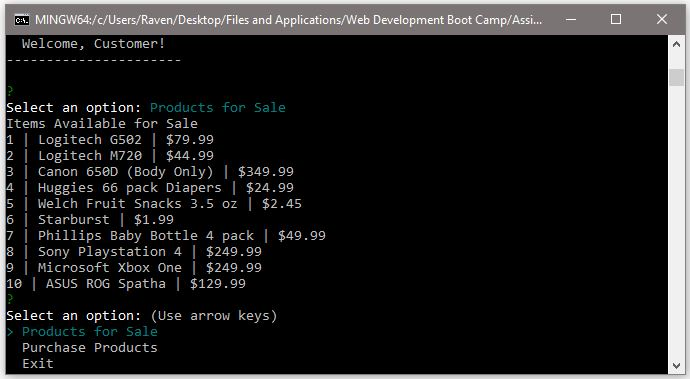

The customer can now choose to purchase a products or exit the program. When they select "Purchase Products", the program brings up a list of the products for sale. The customer can then scroll through what they want to purchase.

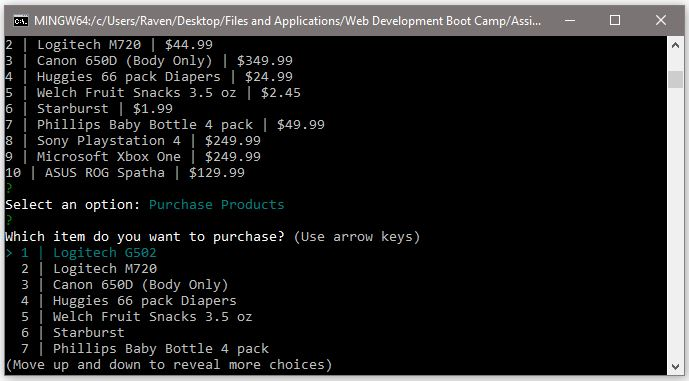

Once the product has been selected, the customer can then enter the amount they want. If they enter a number below 0 or if the stock quantity is not enough, the program will alert the customer and prevent any changes to the database. The customer must enter a valid input to continue.

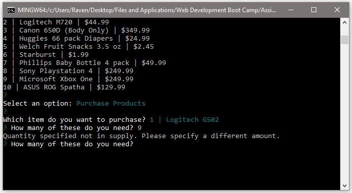

When the customer has purchased the product, the program will confirm their purchase by displaying the quantity and product that was chosen by the customer. The customer can now purchase more items or exit the program.

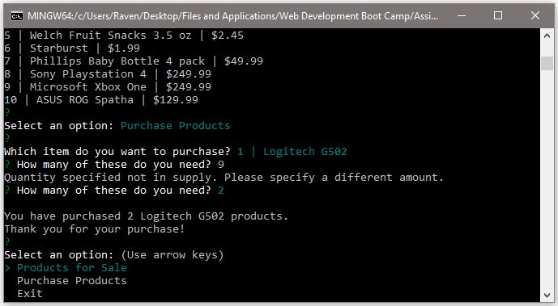

#### Manager User Interface
Like the customer, the manager is greeted with a few choices upon start up. There are a few more options compared to the customers' view.

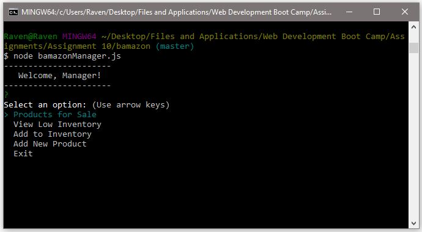

We will skip over "Products for Sale" as we've already covered it in the customer view. The manager can view the products that have stock quantities less than 5. They can do this by selecting the "View Low Inventory" selection. This will send a query to the database to display only the products with less than 5 units in stock.

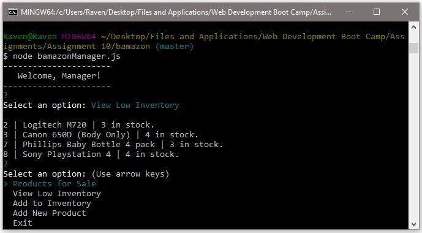

The manager can also add inventory for the existing products in the database. This will bring up a list of all of the products in the database.

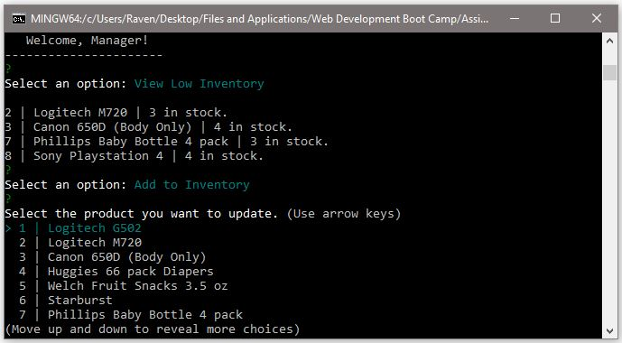

Once the product of choice has been chosen, the program will prompt the manager how many more items they would like to add to the chosen product. The program will not accept any values 0 or less, and will continue to ask the manager until a valid input is entered. Once the program receives a valid input, it brings up a confirmation of the chosen product and how many units were added to it.

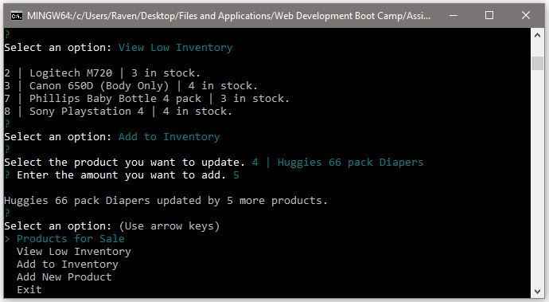

The last option is to add a new product. The manager can add a new product into the database with this option. When selected, the program will ask to input the product name, department, consumer price, and stock quantity. Once the values have been submitted, the program will then show a confirmation of what was sent into the database.

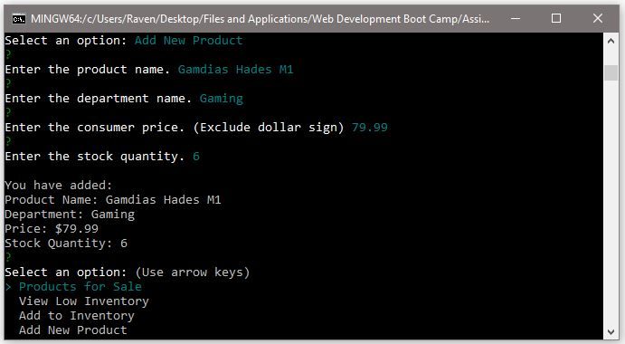

Now if we go back to view the products for sale through both customer and manager view, we can see the product that was just added by the manager.

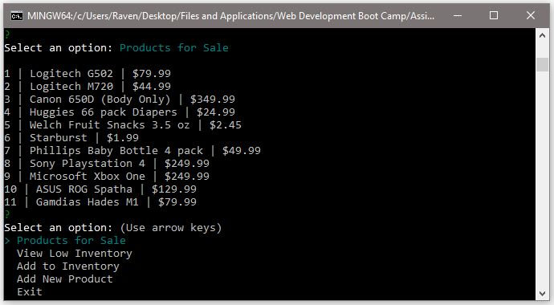
