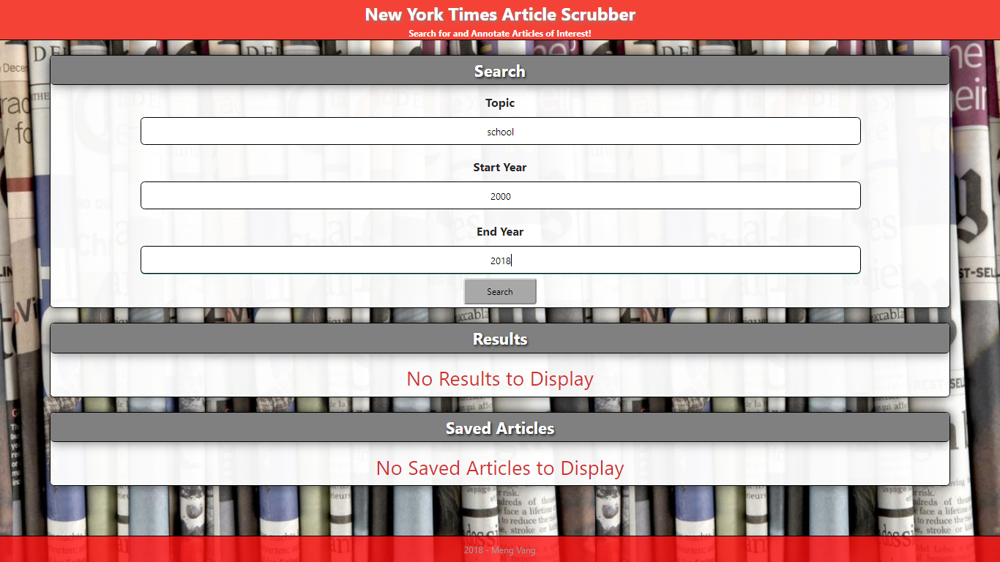
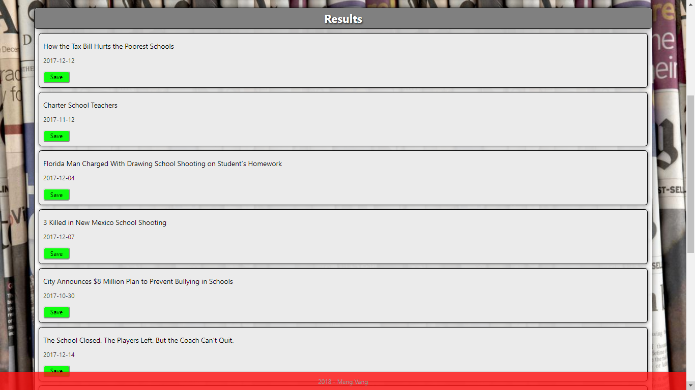
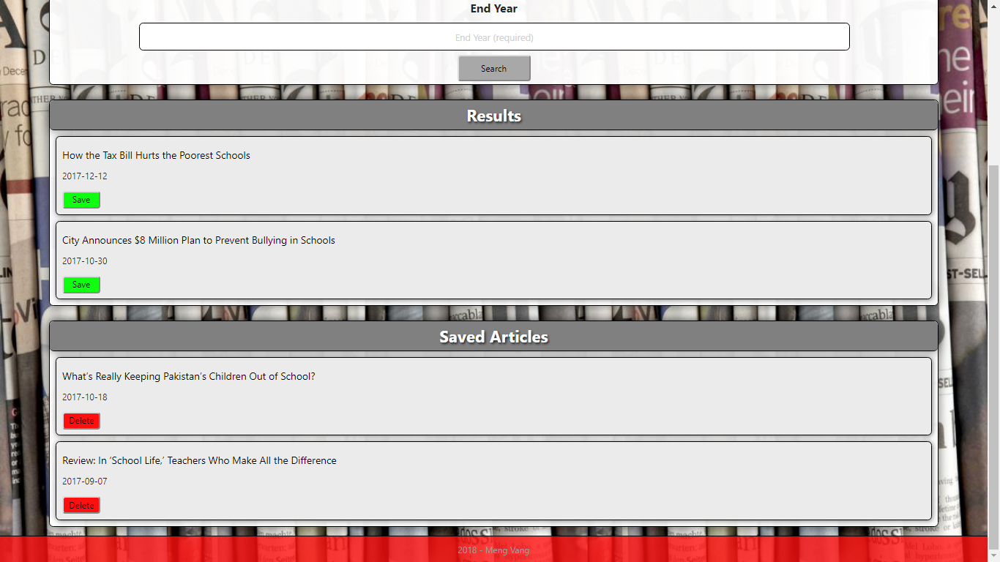

# New York Times React Scrubber

### [View the app here](https://nty-scrubber-mvang92.herokuapp.com/)

## Program Description
This full-stack React-based application is a rendition of the New York Times Article Search application. This application utilizes
React components, helper/util functions, and the React mounting lifecycle to query and display articles based on user searches.
Other technologies include Node, Express, and MongoDB so that users can save articles to read later. Materialize was also used for styling.

## Screenshots

The app looks simple with an easy to read layout. A user must enter the topic of choice, the start year, and end year. If no articles or saved articles are found in the database, the panels would show a no display text.

The API will grab the results that fall within the user's search credentials. Below is an example where the user is searching for any school related articles between the years 2000 and 2018.

10 results will populate the results panel once the user searches for an article. Each article will display the headline, the date of when it was written, and a save button to save the article for later.

Once the user has chosen to save an article, the article is moved into the saved articles panel. Here, the user can choose to read the article or delete it from the database. 

* Of course, the appearance and functionality of the app may change, so these images may not be entirely accurate.

## Technologies Used
* ReactJS
* NodeJS
* ExpressJS
* MongoDB
* Materialize